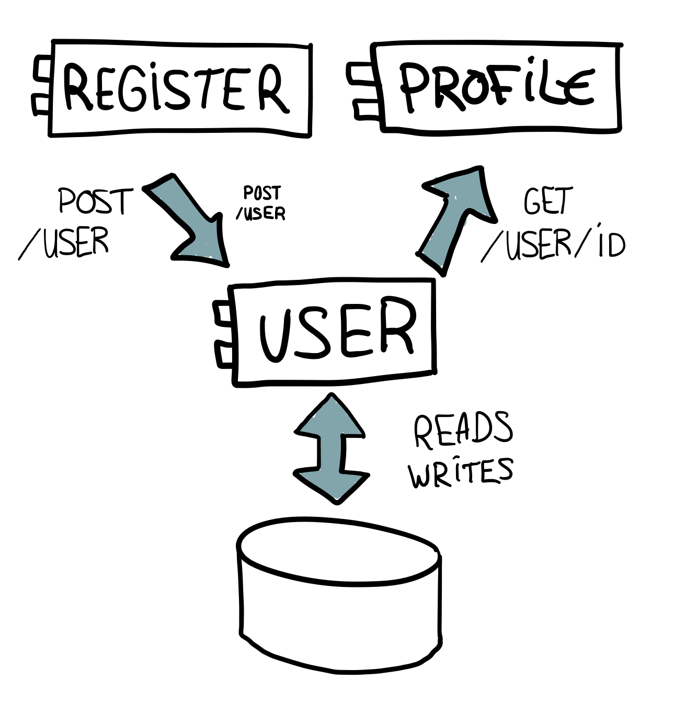

# A User Service is a Smell

The domain of Happy Pancake is all about users and user interactions. Maybe this is why people act surprised when I show them our Micro Services design that holds over 30 services. When they cannot find a single service named User or Member they start to question.

> You do not have a service for the User?

This is the moment I tell them having a User service is a smell of bad design and misunderstanding of what your domain is really about. Let me explain you why.

## Micro Service

A Micro Service can be described by the following characteristics:

* Does one thing
* Does it well
* Is small sized
* Has little value on it own
* Adds value by collaboration

Designing these services is far from easy. It took us almost a year of design iterations to get at a stable state. Before that new insights could cause major redesign of certain parts. The hard part is first truly understanding the behavior and goals in your domain and then finding the correct boundries for the services. You want to break the problem down into correct pieces that have the least amount of coupling and the maximum amount of cohesien.


How should could a User service look like? First I thought about the 




Our domain is so user centric that properties of the user are literally everywhere. When you are in chat an conversation we show the one you are chatting with in form of nickname, age and a portrait picture. The profile page also shows this information in addition to other things like the city of the user, a presentation text and pictures. Not all properties are always visible. An example of this the hash of the users password. We never display that information anywhere, but use it during the login procedure. Another example is the email address of a user which is never displayed but used to send notify or contact the user.

[OVERVIEW]


----
Please take a moment to think about the last time you did model a User. How did it look like? Did it had properties like `id`, `username` and an `email`?

Let me give a brief introduction to our domain and I ask you to think of properties that might fit our User model.

> You can register at our website with their email address and an password of their liking. You also provide a nickname, gender and orientation. You can expand your profile with some information like body length and city. The most prominent parts for others are your profile text and photo's. We match you to other people and suggest you interesting people. When you find someone interesting you can send a message to that person to start a converstation.

How do you think our User model looks like? Here is a selection of some properties people came up with during one of my last presentations.

```
type User {
    id uuid
    email EmailAddress  
    username string
    passwordHash CryptoHash
    city City
    birthday Date
    presentationText string
    gender Gender
    orientation Orientation
}
```

Services
--------
